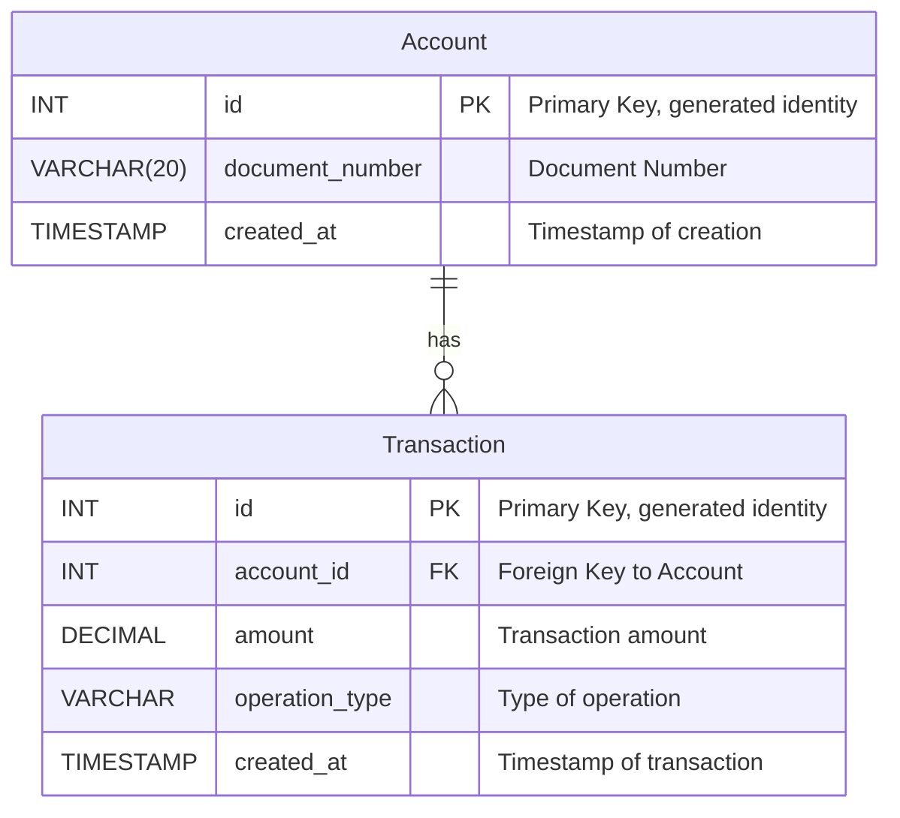
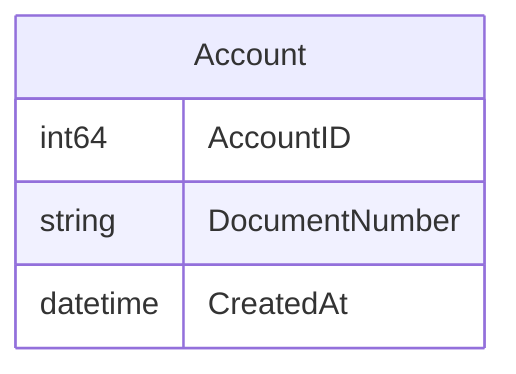
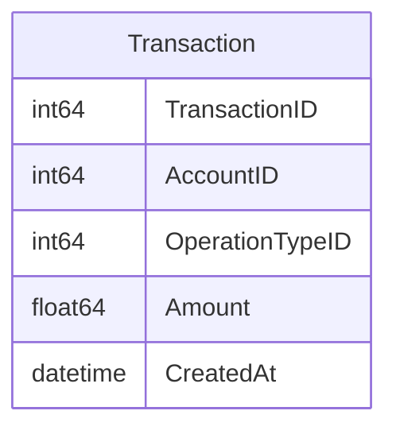

# transactions
Transactions HTTP API

## What is this?
The Transactions service is a simple HTTP API that enables the creation of Account and Transaction resources.

## How do you start the service?
The service and all its requirements are defined in a [docker compose file](docker-compose.yml).

Run the docker compose up command to start the service -

```sh
docker compose up
```

This will start the Transactions service and a test postgres database instance with a seeded schema. When the Transactions service is ready it will be exposed on localhost port 3333.

## What are the config options and their default values?

Config options are controlled by environment variables. This list shows each option with its default value -

| Config Option           | Type   | Default Value | Description                              |
|-------------------------|--------|---------------|------------------------------------------|
| TRANSACTIONS_PORT       | int    | 3333          | The port for the server to listen on     |
| TRANSACTIONS_DBHOST     | string | localhost     | The database host address                |
| TRANSACTIONS_DBPORT     | int    | 5432          | The port for the database connection     |
| TRANSACTIONS_DBUSER     | string | postgres      | The database user name                   |
| TRANSACTIONS_DBPASSWORD | string | example       | The password for the database user       |
| TRANSACTIONS_DBNAME     | string | postgres      | The name of the database                 |

## How do you create an Account?
```sh
curl -X POST http://localhost:3333/account \
     -H "Content-Type: application/json" \
     -d '{
           "document_number": "12345678901"
         }'
```

## How do you retrieve an Account?
```sh
curl -X GET http://localhost:8000/account/<ACCOUNT ID>
```

## How do you create a Transaction?
```sh
curl -X POST http://localhost:3333/transaction \
     -H "Content-Type: application/json" \
     -d '{
           "account_id": 55,
           "operation_type": "PurchaseInstallments",
           "amount": -100.01
         }'
```

## How do you retrieve a Transaction?
```sh
curl -X GET http://localhost:3333/transaction/<TRANSACTION ID>
```

## Database schema



## Data models

### Account


### Transaction



